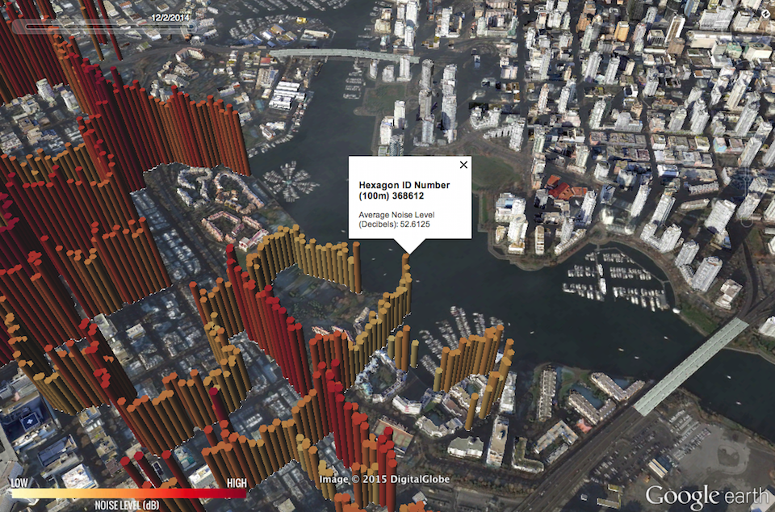
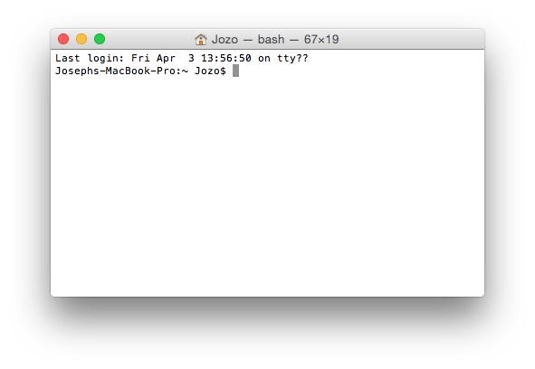

# Geog 311 - Urban Environments: Noise Mapping Exercise

***

**Instructor**: Andreas Christen, Sally Hermansen, Noah Quastel

**Mapping/Visualization**: Joey Lee

**Data Collection**: Students of Geog311 - Urban Evironments

## Overview
As part of UBC's Geography 311: Urban Environments Course, this project aims to get the class out into the city, to engage in the process of crowdsourcing data, and to begin thinking about ways to understand the data that we measure.   

## Dependencies
This project uses the following software:

###Core
	Python 2.7
	
### Libraries
	Pandas
	Geopandas
	numpy
	shapely
	fiona
	simplekml
	matplotlib

## Setup
On Mac OSX Yosemite 10.10.2: Open up the terminal.

### Homebrew:
Homebrew is a package manager to make sure all your libraries are in the right place. We'll use this to download python and all the libraries mentioned above.

	ruby -e "$(curl -fsSL https://raw.githubusercontent.com/Homebrew/install/master/install)"
	
### Install python through homebrew

	brew install python

### install Pip
Pip is the python package manager 

	sudo easy_install pip

### Install GDAL
Gdal is the geospatial data abstraction library - needed for geopandas, shapely, fiona, etc.

	brew install gdal

### Install the libraries

	pip install pandas numpy shapely fiona simplekml matplotlib

### Install the development version of geopandas to get the geopandas.tools
	
	pip install git+git://github.com/geopandas/geopandas.git

Your machine should now be ready to run the scripts! 

***
# Scripts

The workflow is: 

0. Create grids for study area (see qgis for this) --> 
1. Create noise grid averages --> 
2. create the elevated 3D bars for noise

## 1. Creating Noise grid averages

First create grids in qgis OR use the existing grids in the "data/input/grid" folder. To make grids go to: 
	
	# See the Qgis Plugin  - MMQGIS for making grids:
	http://michaelminn.com/linux/mmqgis/
	

Make sure the input files are correct:

	# set the input grid size
	igrid = '~/geog311-noise/data/input/grid/SquareGrid/grid10m.shp'
	
	# set the correct path to the noise data
	ipoints = '~/geog311-noise/data/input/noise/2015/csv/GEOG311-Noise-2015.csv'
	
Make sure the lat/lon fields are specified:

	lat = "Latitude"
	lon = "Longitude"
	
Currently the projection for the grid will probably be in  UTM zone 10N - if it isn't change it. Currently the default is:

	gridproj = {'init': 'epsg:3740', 'no_defs': True}
	
Set the correct output directory:

	# set output directory
	odir = '~/geog311-noise/data/input/noise/2015/_gridavgs/10m'

Run the script:

	# cd to the directory in which the scripts live
	cd "~/geog311-noise/_scripts"
	
	# run the code
	python points2grid.py

## 2. Noise data

In the "_scripts" folder, you'll find the python code to turn the noise data into the elevated bars.
	
	# point the input file to the right gridded average file
	ifile = '~/geog311-noise/data/input/noise/2015/_gridavgs/10m/GEOG311-Noise-2015_gridavg_10m.shp'
	
	# make sure the field for the noise field is specified
	zfield = 'Decibel'
	...
	
	# make sure the output directory is in the right place
	odir = "~/geog311-noise/data/output/noise/2015/"

Then run the script

	# cd to the directory in which the scripts live
	cd "~/geog311-noise/_scripts"
	
	# run the code
	python makecensus.py
	
	
## Census Data
Open the makecensus.py script in a text editor and change the for the input data and output folder:

	# The input census data
	ifile = '~/geog311-noise/data/input/census/2011/census2011_wgs84.shp'
	# set the output directory
	odir = "~/geog311-noise/data/output/_kml/census/"

	
To run the script:
	
	# cd to the directory in which the scripts live
	cd "~/geog311-noise/_scripts"
	
	# run the code
	python makecensus.py

